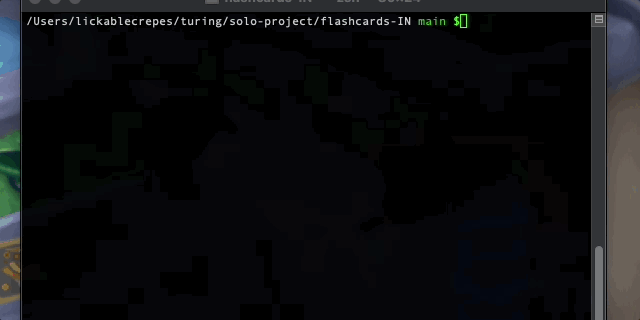

# FlashCards Starter Kit


## Abstract
Flashcards is a multiple choice game that is run in the command line. The game will generate a round with a number of questions and users will answer one question at a time. When the round ends, the user will know their score and how long they took to play. This was developed using Test Driven Development (TDD)

## App in Action


## Instructions 

### start game
Start the game by running node index.js

### Playing the Game
- Use the up and down arrow keys to make highlight your answer in a different color. 
- Hit the `Enter` key to submit your answer. 
- The game will tell you whether you were correct or not.
- Hit the `Enter` key again to move on to the next question
- When the round ends, the game will let the user know their score and how long they took to play. The game will automatically and and you will be returned to the command line. 
- To exit the game at any point use `Ctrl + c`

## Technologies Used
- Javascript
- Mocha framework
- Chai assertion library

## Setup

Clone down the forked repo (from your GitHub). Since you don't want to name your project "flashcards-starter", you can use an optional argument when you run `git clone` (you replace the `[...]` with the terminal command arguments):

```bash
git clone [remote-address] [what you want to name the repo]
```

Once you have cloned the repo, change into the directory and install the library dependencies. Run:

```bash
npm install
```

To verify that it is setup correctly, run `npm test` in your terminal. You should have 5 pending tests in your `Card` test file that show up.

Running `node index.js` from the root of your project should result in the following message being displayed in your terminal: 

```bash
Your project is running...
```

Run your test suite using the command:

```bash
npm test
```

The test results will output to the terminal.


